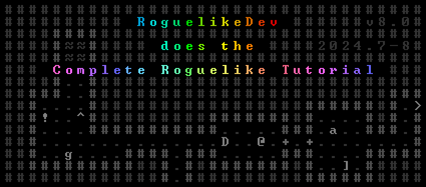
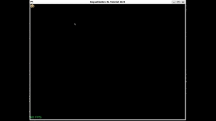

# RoguelikeDev Does the Complete Roguelike Tutorial 2025



Greetings! This is my entry in [/r/roguelikedev's](https://www.reddit.com/r/roguelikedev/comments/1luh8og/roguelikedev_does_the_complete_roguelike_tutorial/) Complete Roguelike Tutorial 2025 event. My goals are as such:

* Produce a playable, reasonably complete game
* Make use of [Odin](https://odin-lang.org), a general-purpose programming language that picks up where C left off, and in the process, learn more about the language
* Make use of [Raylib](https://raylib.com), a code-first programming library with bindings to many languages (including Odin), instead of a terminal-emulation library (like my favorite [BearLibTerminal](https://github.com/cfyzium/BearLibTerminal))

# DevLog

## Progress At a Glance

* [x] Week 1 - Setting Up, Moving @
* [x] Week 2 - Generic Entity, Render Functions, Map, Generating a Dungeon
* [x] Week 3 - Field of View, Placing Enemies and Kicking Them
* [x] Week 4 - Doing and Taking Damage, Interface
* [x] Week 5 - Items and Inventory, Ranged Scrolls and Targeting
* [ ] **Week 6 - Saving and Loading, Delving into the Dungeon**
* [ ] Week 7 - Increasing Difficulty, Gearing Up
* [ ] Week 8 - Conclusion

## Week 1 (2025-07-15) - Development environment, moving @

### Dev Environment

VS Code with the following required extensions:

* [C/C++](https://marketplace.visualstudio.com/items?itemName=ms-vscode.cpptools)
* [Odin Language](https://marketplace.visualstudio.com/items?itemName=DanielGavin.ols)

I am working in a WSL Ubuntu instance on a Windows host. Windows build scripts will come soon.

### Plumbing Work



This week, I decided to lay a good bit of plumbing down - more than one would expect for the simple task of getting an @ moving. I have the benefit of some experience here, as I was recently tinkering with Odin and Raylib before this. I'll be using the Lovable Rogue tileset by surt, found [here](https://opengameart.org/content/loveable-rogue), embedding it directly into the executable. Since many asset licenses prohibit redistributing assets, I like that it is relatively painless to embed a file into an executable with Odin's `#load` function.

*Note:* I have modified the original spritesheet to include only the tiles I will be using.

I am using the built-in Raylib 2D camera for zoom. I haven't decided if I will use scrolling in this game or not, but if I do, I will wind up implementing my own hand-rolled basic camera that I've been using in toy roguelikes for many years. That decision can wait until next week. The play area will be 40 by 30 tiles, with UI elements going directly on top.

Another goal I had was to add just a bit more polish than I normally would with ASCII tiles. I have the bones of smooth movement in this current implementation, but time will tell if I continue down this path.

### 2025-07-16

Added the Windows build script and moved the week1 tag. I am satisified for Week 1.

## Week 2 (2025-07-22) Basic entities, map, dungeon generation

No new code added today; currently brainstorming how I will lay out maps. My goto method is a 1-dimensional array indexed by width.
I will try to set up a new branch, as well as tags, for each week.

### 2D index into 1D array

Imagine a 3x3 map:

```
###
#X#
###
```

The `X` is at point (1, 1) in a standard coordinate system with y increasing downwards. Now, moving left to right, then top to bottom, count from zero through the map:

```
012
345
678
```

Each number is an index into the array storing the map. Thus, our point (1, 1) is at index 4, There is a simple way to calculate this index for any point int he map, given the width of the map (here 3):

```
index = y * map_width + x 
    -> 1 * 3 + 1 
    -> 4
```

In fact, there is also a way to decompose an array index into a unique coordinate, again given the width of the map:

```
x = index % map_width
y = floor(index / map_width) /* Integer Division */
```

As in the above example:
```
x = 4 % 3 -> 1
y = 4 / 3 -> 1
```

I usually wrap these operations into two helper functions that I call `idx` and `deidx` respectively. Algorithms and procedures will work with 2D coordinates and go into 1D mode only when interfacing with the raw data.

I've tinkered a lot with this design - not just in Odin, but in other languages like C - and I do like this pattern for low-level languages.

### Tiles

Tiles themselves will be an enumeration. Odin does magical things with enumerations (see my sprite atlas implementation).
That enum will look something like this:

```odin
Tile :: enum {
    NullTile,
    Wall,
    Floor,
    DoorClosed,
    DoorOpen,
    StairsDown,
}
```

The map data will be an array whose items are members of this enumeration. This allows the map data to be lightweight.
Anything else associated with tiles - like sprites and terrain properties - can be dealt with using switch statements at the sites where they are needed.

### 2025-07-23

I am going to stick with what I know for the map, using the system I detailed above. I will also use Odin's parametric polymorphism (generics) features to make the grid structure generic, so I have the option to use it for other things like LOS and explored tiles.

I have begun refactoring things to separate files as well. 

Basic map drawing is in. Still haven't decided if I want to support scrolling maps yet.

## Week 3 (2025-07-29) Field of View, basic enemies

I'm still stuck on Week 2 because of tileset issues. I've been experimenting with map generation methods and with all of them, I'm feeling like the tileset is missing a couple of crucial tiles. I also don't like how the vertical walls have so much space, which looks strange when I have the player stop at walls.

I am strongly considering changing tilesets and have been looking at others. I might be able to make this tileset work with some extra code to flip tiles. I either need a single-block solid wall tile or three more tiles: 4-way intersection (&#x253C;), and two T-insersections (&#x2534; &#x252C;)

### Entities

In the meantime, I am also considering my entity system. It is a classic choice to use some kind of ECS, but those are not trivial to implement in lower-level languages. I will have an `Entity` struct containing common components like `position`, `tile`, `name`, etc. and have a union which contains the data that will be different. It might look something like this:

```odin
Entity :: struct {
    name: string,
    desc: string,
    pos: Point,
    tile: Tile,
    color: rl.Color,
    type: union {
        Mobile,
        Armor,
        Weapon,
        Trinket,
        Consumable,
    }
}
```

I will hold these entities in some kind of data store (probably a map) and access them using some kind of handle system.

### TileMap Change!

I have decided to swap to a different tileset (see changes above). This work is in a separate branch `week2-new-sheet` in case I decide to go back to the original tileset I was using.

After refactoring all of my map generation code to use only one wall marker and change which tile displays depending on the surrounding walls (this took a few iterations to get right), I finally have maps that at least look coherent

### 2025-07-30

The entity plumbing is now in. I may return during a later phase to map generation since the perfect mazes produced by the recursive backtracker tend not to make for fun exploration in practice. With the entity plumbing hooked up to the rest of the game (and smooth movement disabled until a possible future polish phase), I am ready to tackle Week 3.


### 2025-08-02

FoV and basic collision detection are in. As a bonus, I even have sound! I have decided to use a basic raycasting algorithm I found on [RogueBasin](https://www.roguebasin.com/index.php/Eligloscode) as it's fast enough for the scope of the project. This completes the objective for Week 3.


https://github.com/user-attachments/assets/f08a089e-ccbf-4722-831e-d736157399c4


## Week 4 (2025-08-05) Damage, Interface

I have gotten something of a jumpstart on this already. I have the bones in place for damage to be shown on the entity taking the damage (though I do need to alter it for situations where the player is standing where damage would show). I do have `cur_hp` and `max_hp` fields on the `Mobile` entity type. Now, I need to decide on the basics of the combat system.

### 2025-08-10


#### Combat System

I have decided on a basic d20 system inspired by games like [Cairn](https://cairnrpg.com/) and [Dragonbane](https://freeleaguepublishing.com/games/dragonbane/). All combatants will have four attributes:

* ST (Strength)
* HD (Hardiness)
* AG (Agility)
* WL (Willpower)

Various game actions, such as attacking, are governed by these four stats. Basic success shall be determined by rolling a d20 against the stat in question. A roll **equal to or below** the given stat is a success. Resisting an adder's poisonous bite, for example, would require a test against HD.

#### The Basic Attack

* Attacker tests ST.
    * On success, defender tests AG.
        * On a 1 from the attacker, defender cannot dodge.
        * Attacker rolls damage.
        * On success, defender accrues Fatigue equal to the damage and dodges the attack.
        * On failure, defender takes HP damage.
    * On failure, attacker misses.
* Attack Fatigue costs:
    * 0 on a 1 rolled on the attack
    * 3 on a 20 rolled on the attack
    * 1 otherwise
* Some monsters and weapons may test AG to attack.
* Some monster attacks may come with secondary effects.

#### HP and Stamina (partially coded)

A creature with 0 HP is **slain.**
A creature with Fatigue >= Stamina is **exhausted** and must **recover**.

**Recovering** takes an action and removes (WL / 2) Fatigue.

HP is influenced by HD.
Stamina is influenced by HD and WL.

## Week 5 (2025-08-12) Inventory, Items, Targeting

I have the bones in place for basic attacks and doing damage. I will continue to revise the system with equipment and consumables. As usual, new code will be in the `week5` branch.

### 2025-08-13

Added basic inventory and monster movement. Currently working on consumable uses. Stat potions will be an important part of progression.

### 2025-08-14

Tweaked the inventory UI and fully implemented the Potion of Healing. Also improved the modularity of debugging messages.

### 2025-08-15

More UI work - adding tooltips and targeting.

https://github.com/user-attachments/assets/955558b3-ea9e-4324-909a-447add8e6f95

### 2025-08-16

The messaging system is in. The last message produced by the game is displayed on top. The player can press `h` to view the last 50 (number subject to change) messages.

https://github.com/user-attachments/assets/3e76117a-9fb2-47a4-8d68-2c31d8aafc7b

## Week 6 (2025-08-19)

Here it is. The bugaboo of saving and loading. Not sure how I want to tackle this just yet. In the meantime, I will add a structure for other dungeons which I think will be simple to add, given the groundwork I have already laid.